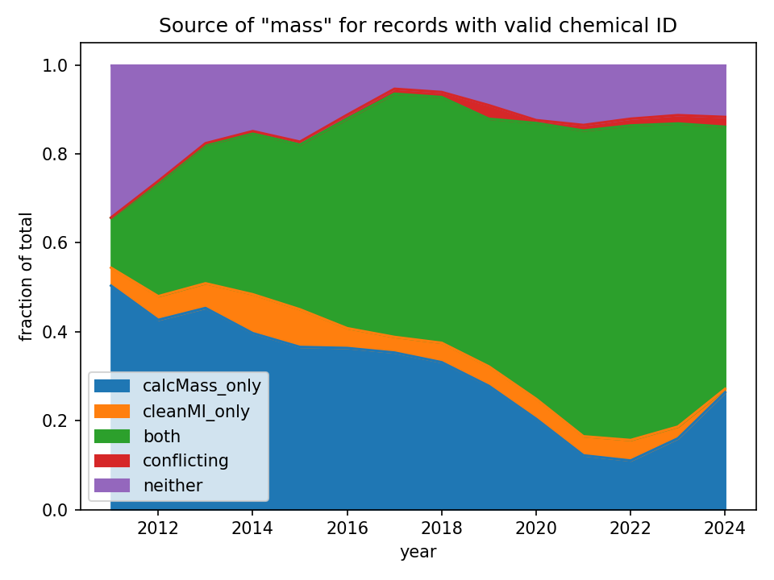

 

<!-- this is a test of a comment 
To do:
--->

|[Prev](Resolving_chemical_identity.md)|[Index](Top.md)|[Next](Standardizing_text_fields.md)|
# Reporting Mass

### Quantity by percentage...
Throughout its website and PDF files, FracFocus provides a limited perspective of chemical quantity; that is, FracFocus  reports quantity as the percentage (by weight) of the chemical compared to the overall fracking fluid. So, for the chemical “water,” FracFocus may record something like 85%.  For “sand,” it will probably be something like 14%. The fracking “additives” together are typically less than 1%. (The figure below is modelled after a figure from the [FracFocus website](https://fracfocus.org/learn/what-is-fracturing-fluid-made-of)[^1].)  The percentages of individual additives are often tiny.  Viewing chemical quantity from only this perspective does indeed make the chemical’s contribution seem insignificant. 

[^1]: Accessed Sept. 30, 2023.

 

### ... and by mass.

However, another way to view chemical quantity is by mass; that is, the absolute weight of the chemical material used. While the percentage perspective above tells us the *concentration* of chemicals in the fracking fluid, it is independent of the overall size of the fracking job.  For example, a typical percentage for hydrochloric acid is 0.06% of the total fracking fluid. If the water carrier for the given fracking job is 16,000 gallons (and using the numbers from the FracFocus example above), a concentration of 0.06% translates to about 90 pounds of the acid.  However, keeping the concentrations the same but examining a larger fracking job of 16 million gallons of water, we find that the acid use is now about 90,000 pounds, or roughly two tanker trucks full, hardly an insignificant amount.  That [16 million gallons of water](https://storage.googleapis.com/open-ff-browser/Open-FF_Scope_and_Aggregate_Stats.html#water_use) was the median fracking job size in 2022. 

As of Sept. 2023, there are more than 300 fracking jobs in the data set reporting over **1,000,000 pounds** of the acid.  Using only the perspective of percentage masks the often massive sizes of chemical usage typical in fracking.

## Open-FF's `mass` field

In the bulk download, FracFocus reports mass directly and indirectly and how it is reported has changed throughout the history of FracFocus and varies by companies and other factors.  Because of that, Open-FF attempts to use as much of the reported data as possible from each disclosure to generate the most representative value we can for each chemical record.

Open-FF's process essentially takes the direct and indirect data streams as separate sources for a given record and then combines them to yield a best-guess `mass` field:

### The direct reports
In the bulk data download, FracFocus includes a field, `MassIngredient`, that reports the weight of the chemical material, in pounds.  While this field has been present for years, it was not documented by FracFocus until 2023. Because of that, Open-FF used the field until recently only to validate the alternative source of mass: calculation from indirect fields. While this field was not available in early years of FracFocus, reporting has been steadily increasing.  

`MassIngredient` values, however, must be tested for internal consistency.   Because FracFocus typically provides both the mass (`MassIngredient`) and the percentage of the whole fracking fluid (`PercentHFJob`), we can calculate the total mass of the fracking fluid *from every record* in a disclosure.  We judge `MassIngredient` values to be internally consistent when this set of calculated total mass values are essentially the same across the disclosure (within a small tolerance).  When they are not, we flag the `MassIngredient` values for that disclosure as internally inconsistent and do not use them for comparisons to Open-FF's `calcMass`. Currently there are more than 20,000 *disclosures* with inconsistent `MassIngredient` values.  (As of May 2024, we are finding more errors in `MassIngredient` even when `MassIngredient` is internally consistent. See notes below.)

**********
### The indirect reports

We can also determine the mass of every record in a disclosure by using the *volume* (`TotalBaseWaterVolume`) of the carrier to calculate the `mass` of the carrier and then the total fracking mass and from there, the mass of every record.

Here is a more detailed description using that example above of a typical fracking job in 2022:

Taking the simple fact that one gallon of water weighs about 8.3 pounds, we find that 
> the base water weighs **about 130 million pounds.** 

If we use that typical 85% for water, that means 

> the total fracking fluid weighs about **156 million pounds.**

Finally, if we use a [typical percentage of hydrochloric acid](https://storage.googleapis.com/open-ff-browser/7647-01-0/analysis_7647-01-0.html#detailedAbundance) (0.06% of the whole fracking fluid), we find that translates into 
> over **90,000 pounds of acid**.

#### Data required for mass calculation
This simple method of calculating masses with in a fracking disclosure has been verified by the technical staff of FracFocus.  It depends on a few important pieces of data: 
1. The total base water volume which is given in most disclosures,
1. a specific indication which records in the disclosure are the carrier water, 
1. and an assumption that the carrier is indeed water.

For item 1, there are many disclosures without this value in FracFocus, or a value of zero gallons is given. For these disclosures, we cannot calculate mass of any records.

For item 2, this value is clear for a large majority of disclosures. But in the remainng, Open-FF employs algorithms to identify the carrier record(s). Roughly 0.5% of disclosures cannot be characterized this way.

For item 3, we assume simple water is the carrier for our denisty multiplier when the density is not specified directly.  While this simplifying assumption may be off when recycled or produced water is used, those other products are typically of higher density.  Therefore our simple assumption likely underestimates masses.

## Bringing the direct and indirect together
Open-FF condsiders both data streams when reporting mass.  In most cases for recent fracking jobs (see figure below), when we compare the two streams they are very close and we report `MassIngredient` as our `mass` value. When only one of the two streams is available for a disclosure, that data is reported as `mass` (and the field `massSource` indicates that source).  If the two sources are available, but they conflict, we do not report a value for `mass` because we cannot know which is the correct one.  And finally there are some disclosures, especially in early years of FracFocus, that neither source is available.

Currently, there are over 2.7 million records in which the `calcMass` and `MassIngredient` agree and only around 50,000 where they do not (and therefore we do not report `mass`). When we have investigated those discrepancies, they seem often attributable to `MassIngredient` issues.
**NOTE: As of May 2024, we are finding more errors in `MassIngredient` even when `MassIngredient` is internally consistent. Until we build code to detect and exclude these errors, we have paused using `MassIngredient` as the source of `mass` when it is the only source available, the "cleanMI_only" segment of the figure below.**

#### An important caveat
The quantity as recorded in disclosures is the "Maximum Ingredient Concentration in Additive (by % mass)." The mass we calculate (and perhaps the directly reported `MassIngredient` too) is a MAXIMUM in a range of possibilities. This comes about because chemical information in a disclosure is often extracted from Material Safety Data Sheets (MSDS) for a trade-named product in a fracking job. In the MSDS, the amount of each component in the product is usually given as a range. Manufacturers of these products may report a range to reflect variation in the manufacturing process or to protect confidential recipes. Here's an example of a product by Chemplex[^2]:

 

[^2]:The figure shows a portion of an MSDS downloaded from https://ohiodnr.gov/wps/portal/gov/odnr/discover-and-learn/safety-conservation/about-ODNR/oil-gas/sds in Aug., 2021.

In this case, Ethylene glycol may be as low as 12% in the product or as high as 15%. FracFocus indicates that companies using this product should report the 15% number in the disclosure and this will be reflected in the `PercentHFJob` value and, therefore, our calculated mass.

This dependence on MSDS and maximum values creates an odd situation: sometimes the total percentage for a product (and for a whole disclosure) will be greater that 100%. Other times they will even be less than 100% because MSDS don't necessarily report all the ingredients in a product, only the "hazardous" ones.

In Open-FF, when evaluating whether a disclosure's total percentage is ok, a 5% tolerance is acceptable: 95-105%.

|[Prev](Resolving_chemical_identity.md)|[Index](Top.md)|[Next](Standardizing_text_fields.md)|
