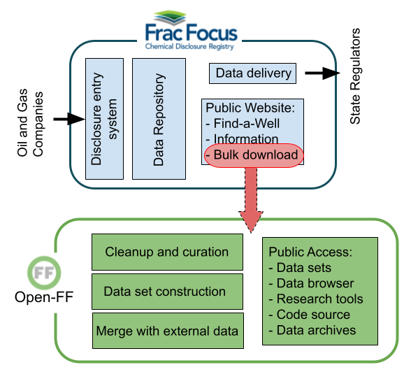

 

<!-- this is a test of a comment 
To do:
--->

|[Prev](What_is_FracFocus.md)|[Index](Top.md)|[Next](Resolving_chemical_identity.md)|
# Open-FF Overview

 

Open-FF is an independent project to transform the FracFocus data into a useful resource for researchers, journalists and community advocates. The open source project has been evolving for several years and FracTracker Alliance has recently started sponsoring the effort.

At its core, Open-FF simply takes the FracFocus data and pairs it with corrections, clarifications, calculations, and alerts that add perspective to the industry’s published data. This core data set is then packaged in a number of ways to make it available online to everyone from the hard-core data analyst to the non-technical casual browser. 

Two of the most important features of a chemical disclosure instrument are unambiguous chemical identity and quantity.  For the first of those, Open-FF uses the two chemical identifiers reported  in FracFocus to resolve identity in the many cases that FracFocus data is ambiguous.  The primary identifier is the CAS Registry Number that is a standard authoritative number widely used to uniquely characterize materials.  While the FracFocus website advises users to give priority to this CASRN, there are many errors and omissions that require us to also use the second identifier, an ingredient name. This work is accomplished with a combination of software and manual curation.  See the [resolving chemical identity](Resolving_chemical_identity.md) page for more details.

Throughout the FracFocus website and data, the quantity of chemicals is represented by a limited perspective: the percent of the mass of the entire fracking fluid that the individual chemical comprises.  These percentages are typically very small because in a typical fracking job, all chemical additives together (everything but the water and sand) are usually less than one percent.  But this perspective obscures very large absolute masses of chemical reports when fracking jobs are very large.  Open-FF uses data contained in FracFocus disclosures to calculate and verify those masses and make them available to users.  See the [calculating mass](Calculating_mass.md) page for more details.

In addition to these two core features, Open-FF performs other checks and clarifications, tries to resolve non-standardized text fields, and provide perspective to the chemical data reported in FracFocus.  The data set is updated regularly with new disclosures available for download.  Further, Open-FF generates an online "browser" with which users can explore many features of the FracFocus data without needing to download files.

### History of Open-FF

Open-FF’s development between 2019 and 2023 is documented at [CodeOcean](https://codeocean.com/) in three projects, ["FracFocus Cleanup - Proof of Concept"](https://doi.org/10.24433/CO.8896584.v6) to v6, ["query-FF"](https://doi.org/10.24433/CO.5619215.v7) (a tool to help novice programmers extract data) to v7, and ["Open-FF"](https://doi.org/10.24433/CO.1058811.v16) to v16.  These projects included the code that generated the final data sets and the data sets themselves, but did not include the portions of the code that aided the curation phase of the generation nor the other features of Open-FF.

The [Data Browser](https://storage.googleapis.com/open-ff-browser/Open-FF_Catalog.html) began in 2020 and was hosted on a Google Drive through [drive2web](https://www.drv.tw/).  The intention behind the Browser is to allow a user to get a perspective on fracking's chemical activity without requiring that user to download data or perform analysis.  It's tools continue to expand.

Furthermore, Open-FF is currently developing more specific tools using jupyter notebooks that are geared to helping non-progammers answer more targetted questions than could be answered by the Data Browser.  These notebooks are intended to be used on a resource such as [Google's Colaboratory](https://colab.google/).

|[Prev](What_is_FracFocus.md)|[Index](Top.md)|[Next](Resolving_chemical_identity.md)|