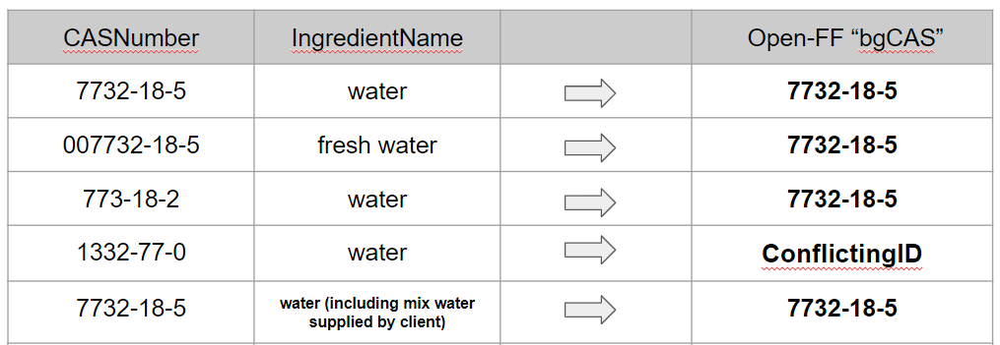

 

<!-- this is a test of a comment 
To do:
Current method that ranks ingredientname with synonyms, etc
--->

# Clarifying Chemical Identity

Chemicals in FracFocus are disclosed with two identifiers: a name and a CAS Registry Number® (CASRN) (the Chemical Abstract Service assigns authoritative identifiers for materials).  Unfortunately, there are often errors in one or both of these identifiers and they can even be conflicting.  Where possible, Open-FF clarifies the identities; when not possible, it flags problem records. There are currently over 1,300 materials identified.  The following process is performed on new and changed disclosures with every update (roughly once a month). 

## Methods
Resolving chemical identity is centered on two FracFocus fields: `CASNumber` and `IngredientName` with the goal of generating the  Open-FF field, `bgCAS` (our best-guess CASRN).  

 

The first step when analyzing new data from FracFocus is to identify novel `CASNumber`s.  If necessary, the prospective CASRN is coerced into a valid format and is checked against SciFinder (the Chemical Abstract Service's research tool) to verify that it is a valid chemical.  Typographically errors are frequent and can often be corrected.   Non-valid `CASNumber`s are assigned as "proprietary" or "ambiguous." Currently there are over 2,800 unique values in `CASNumber`.

For reference, Open-FF generates a synonym table of ingredient names from three sources: SciFinder, EPA's CompTox tool and a table of non-specific chemical names from [a 2016 EPA document analysis of FracFocus data](https://cfpub.epa.gov/ncea/hfstudy/recordisplay.cfm?deid=332990). Collectively, these 170,000+ synonyms link to specific CAS numbers of known chemicals used in fracking and related operations.  ([This synonym table](https://storage.googleapis.com/open-ff-browser/Open-FF_Synonyms.html) is available in the Data Browser.)  When a new CASRN is detected in FracFocus, all synonyms of that chemical are added to the synonym table as well.

In the second step, Open-FF tries to independently determine a CASRN based on `IngredientName`.  (These names and the synonym table are all converted to lower case to eliminate non-informative differences. Even so, there are over 17,000 unique names in FracFocus.)  We find close or exact matches to the given `IngredientName` to values in the synonym table, each with a score of how good the matches are along with their prospective CASRN.  Matches below a cutoff score are discarded.

Open-FF then attempts to resolve the identity to `bgCAS` for all unique pairs of `CASNumber`:`IngredientName`.  The set of matches for `IngredientName` (with their implied CASRN) are then compared to the prospective CAS number from the first step.  

 

Ideally, the two prospective CASRNs match and `bgCAS` is assigned that same CASRN. While that occurs much of the time, also common is that an `IngredientName` is not specific enough to resolve to a single CASRN. Occasionally, the two prospective CAS numbers are conflicting.  While the FracFocus website suggests prioritizing the `CASNumber`, there are certainly situations where it is not clear which is correct.  In such cases, we assign "conflictingID" to `bgCAS`. The most difficult to find and correct are records where a typographical error in `CASNumber` yields a valid but incorrect CASRN. That can be complicated without a specific `IngredientName`.  We have found and corrected or flagged dozens of these.

There are currently over 30,000 unique `CASNumber`:`IngredientName` pairs.  However, this curation work has been performed throughout the years of the project; monthly updates usually have only around 100 unique pairs to process.  Occasionally, this table is corrected when we find more information to better resolve the identity.

## Adding perspective

The majority of chemicals on the Open-FF list will be unfamiliar to many users. Furthermore, FracFocus has nothing to say about a chemical’s hazards. To help users learn about the chemicals, Open-FF identifies when a material is a known chemical of concern (for example, is on the Clean Water Act list) and includes summaries of toxicity (such as EPA’s ChemInformatics) when available. 

But the unfortunate reality is that our understanding of the health and environmental impacts of fracking chemicals trails far behind the industry’s introduction of new untested materials. Open-FF is working to develop new ways of helping the public find up-to-date research and perspectives on the potential hazards of fracking chemicals.